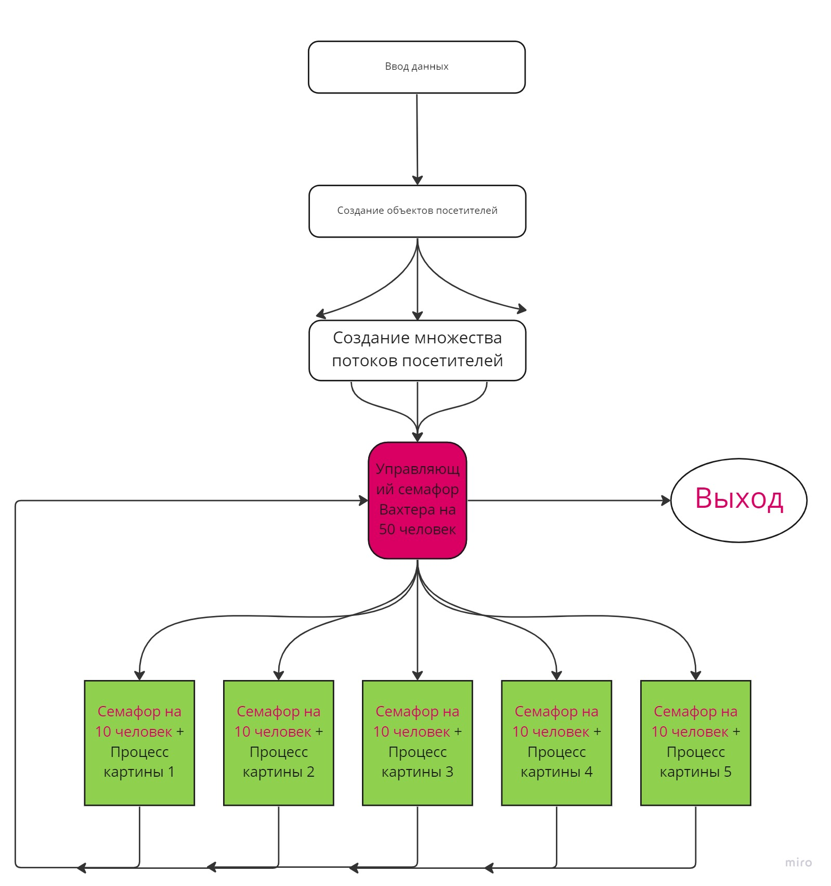

# Отчет ИДЗ 4

## Парахин Николай Викторович

## БПИ 212

&nbsp;

### Вариант 17

__Условие:__
Задача о картинной галерее. Вахтер следит за тем, чтобы в картинной
галерее одновременно было не более 50 посетителей. Для обозрения представлены 5 картин. Посетитель ходит от картины к картине, и если на картину любуются более чем десять посетителей, он стоит в стороне и ждет, пока
число желающих увидеть картину не станет меньше. Посетитель может покинуть галерею. В галерею также пытаются постоянно зайти новые посетители, которые ожидают своей очереди, если та заполнена. __Создать многопоточное приложение, моделирующее однодневную работу картинной галереи.__

## На 4 балла

• Приведено условие задачи.

• Описана модель параллельных вычислений, используемая при разработке многопоточной программы.

    Используется модель: управляющие и рабочие.
    Похожий принцип исользуется в задаче обедающих философов,
    только вместо вилок картины, и вилками могут пользоваться
    большее кол-во людей.
    После ввода кол-ва посетителей, создаются их объекты.
    В каждом объекте посетителя есть свой поток, который запускает
    процесс Вахтера. Процесс Вахтера помогает 
    посетителям просматривать картины и уходить из галереи.

• Описаны входные данные программы, включающие вариативные
диапазоны, возможные при многократных запусках.
    
    Число -> кол.во посетителей. Ввод из консоли, файла, аргументов.

• Реализовано консольное приложение, решающее поставленную задачу с использованием одного варианта синхропримитивов.

• Ввод данных в приложение реализован с консоли.

## На 5 баллов

• В программу добавлены комментарии, поясняющие выполняемые
действия и описание используемых переменных.
    
    Комментарии есть файле main.cpp.

• В отчете должен быть приведен сценарий, описывающий одновременное поведение представленных в условии задания сущностей в
терминах предметной области. То есть, описано поведение объектов
разрабатываемой программы как взаимодействующих субъектов, а
не то, как это будет реализовано в программе.
    
    Сценарий описан в самой программе.

## На 6 баллов

• В отчете подробно описан обобщенный алгоритм, используемый
при реализации программы исходного словесного сценария. В котором показано, 
как на программу отображается каждый из субъектов предметной области.

    Алгоритм:

• Реализован ввод данных из командной строки.
    
## На 7 баллов

• В программу добавлены ввод данных из файла и вывод результатов
в файл.

• Приведены входные и выходные файлы с различными результатами выполнения программы.

• Результаты работы программы должны выводиться на экран и записываться в файл.

• Ввод данных из командной строки расширен с учетом введенных
изменений.

## На 8 баллов

В программу добавлена генерация случайных данных в допустимых диапазонах.

• Приведены входные и выходные файлы с различными результатами выполнения программы.

    Примеры ввода доступны в файлах.

• Ввод данных из командной строки расширен с учетом введенных
изменений.

• Результаты изменений отражены в отчете.
